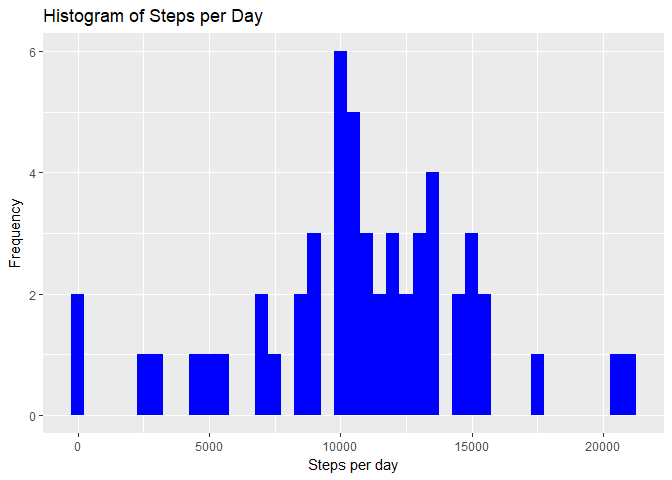
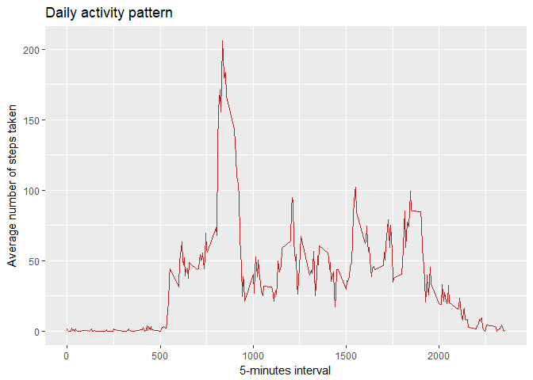
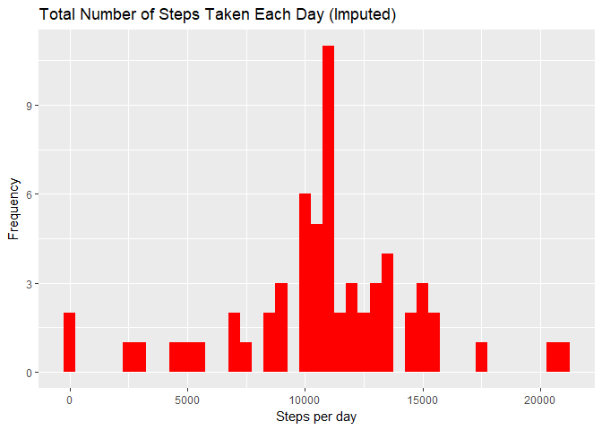
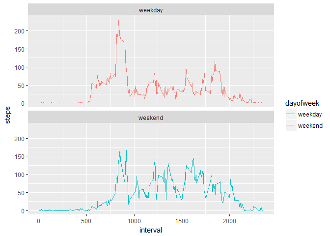

# Reproducible Research: Assignment 1
This is the first project assignment for the Reproducible Research course in Coursera's Data Science specialization track. The purpose of the project was to answer a series of questions using data collected from an activity monitoring devices.

### Checking for required packages and install them if necessary, then load them

```r
if (!require("knitr")) {
	install.packages("knitr")}
```

```
## Loading required package: knitr
```

```r
if (!require("lubridate")) {
	install.packages("lubridate")}
```

```
## Loading required package: lubridate
```

```
## 
## Attaching package: 'lubridate'
```

```
## The following object is masked from 'package:base':
## 
##     date
```

```r
if (!require("ggplot2")) {
	install.packages("ggplot2")}
```

```
## Loading required package: ggplot2
```

```r
library(knitr)
library(lubridate)
library(ggplot2)
```
### Setting the default of echo to be True throughout the whole report

```r
knitr::opts_chunk$set(echo = TRUE)
```
## Loading and preprocessing the data
### Checking if files exist in the folder "RepDataAsignment1" in default working directory, otherwise create the folder, download and unzip the dataset in that folder

```r
if(!file.exists("./RepDataAssignment1")) {
	dir.create("./RepDataAssignment1")}
if(!file.exists("./RepDataAssignment1/repdata%2Fdata%2Factivity.zip")) {
	fileUrl <- "https://d396qusza40orc.cloudfront.net/repdata%2Fdata%2Factivity.zip"
	download.file(fileUrl, destfile="RepDataAssignment1/repdata%2Fdata%2Factivity.zip")}
if(!file.exists("RepDataAssignment1/activity.csv")) {
	unzip(zipfile="./RepDataAssignment1/repdata%2Fdata%2Factivity.zip", exdir="./RepDataAssignment1")}
```

### Loading the data

```r
activityData <- read.csv("activity.csv")
```

### Transforming the data, changing the date format using lubridate

```r
activityData$date <- ymd(activityData$date)
```

## What is mean total number of steps taken per day?
### Summing steps by day

```r
stepsbyday <- aggregate(steps ~ date, activityData, sum)
print(stepsbyday)
```

```
##          date steps
## 1  2012-10-02   126
## 2  2012-10-03 11352
## 3  2012-10-04 12116
## 4  2012-10-05 13294
## 5  2012-10-06 15420
## 6  2012-10-07 11015
## 7  2012-10-09 12811
## 8  2012-10-10  9900
## 9  2012-10-11 10304
## 10 2012-10-12 17382
## 11 2012-10-13 12426
## 12 2012-10-14 15098
## 13 2012-10-15 10139
## 14 2012-10-16 15084
## 15 2012-10-17 13452
## 16 2012-10-18 10056
## 17 2012-10-19 11829
## 18 2012-10-20 10395
## 19 2012-10-21  8821
## 20 2012-10-22 13460
## 21 2012-10-23  8918
## 22 2012-10-24  8355
## 23 2012-10-25  2492
## 24 2012-10-26  6778
## 25 2012-10-27 10119
## 26 2012-10-28 11458
## 27 2012-10-29  5018
## 28 2012-10-30  9819
## 29 2012-10-31 15414
## 30 2012-11-02 10600
## 31 2012-11-03 10571
## 32 2012-11-05 10439
## 33 2012-11-06  8334
## 34 2012-11-07 12883
## 35 2012-11-08  3219
## 36 2012-11-11 12608
## 37 2012-11-12 10765
## 38 2012-11-13  7336
## 39 2012-11-15    41
## 40 2012-11-16  5441
## 41 2012-11-17 14339
## 42 2012-11-18 15110
## 43 2012-11-19  8841
## 44 2012-11-20  4472
## 45 2012-11-21 12787
## 46 2012-11-22 20427
## 47 2012-11-23 21194
## 48 2012-11-24 14478
## 49 2012-11-25 11834
## 50 2012-11-26 11162
## 51 2012-11-27 13646
## 52 2012-11-28 10183
## 53 2012-11-29  7047
```

### Creating an Histogram, and calculate mean and median.

```r
ggplot(stepsbyday, aes(x = steps)) +
  geom_histogram(fill = "blue", binwidth = 500) +
  labs(title = "Histogram of Steps per Day", x = "Steps per day", y = "Frequency")
```

<!-- -->

```r
stepmean <- mean(stepsbyday$steps, na.rm = TRUE)
stepmean <- formatC(stepmean, format = "f", digits = 2)
stepmedian <- median(stepsbyday$steps, na.rm = TRUE)
stepmedian <- formatC(stepmedian, format = "f", digits = 2)
```
The mean is 10766.19 and the median is 10765.00

## What is the average daily activity pattern?
### Calculating average steps for each interval for all days

```r
stepsbyinterval <- aggregate(steps ~ interval, activityData, mean, nar.rm = TRUE)
```
### Plotting the Average Number of Steps per Day by Interval.

```r
ggplot(stepsbyinterval, aes(x=interval, y=steps)) +
    geom_line(color = "firebrick") +
    labs(title = "Daily activity pattern", x = "5-minutes interval", y = "Average number of steps taken")
```

<!-- -->

### Finding interval with highest average steps

```r
interval <- stepsbyinterval$interval[which.max(stepsbyinterval$steps)]
```
The interval 835 has, on average, the highest count of steps.


## Imputing missing values
### Total number of missing values

```r
missing <- sum(is.na(activityData$steps))
```
There are 2304 missing values.

### Creating a new dataset (imputted) that is equal to the original dataset but with the missing data filled in with the mean for the 5-minute interval

```r
imputted <- activityData
for (i in stepsbyinterval$interval) {
    imputted[imputted$interval == i & is.na(imputted$steps), ]$steps <- 
        stepsbyinterval$steps[stepsbyinterval$interval == i]
}
```
### Making a histogram of the total number of steps taken each day and calculate the mean and median

```r
stepsbyday_imputted <- aggregate(steps ~ date, data = imputted, sum)
ggplot(stepsbyday_imputted, aes(x = steps)) +
  geom_histogram(fill = "red", binwidth = 500) +
  labs(title = "Total Number of Steps Taken Each Day (Imputed)", x = "Steps per day", y = "Frequency")
```

<!-- -->

```r
newstepmean <- mean(stepsbyday_imputted$steps)
newstepmean <- formatC(newstepmean, format = "f", digits = 2)
newstepmedian <- median(stepsbyday_imputted$steps)
newstepmedian <- formatC(newstepmedian, format = "f", digits = 2)
```
The mean is 10766.19 and the median is 10766.19

### Do these values differ from the estimates from the first part of the assignment? What is the impact of imputing missing data on the estimates of the total daily number of steps?

- The mean is the same as the mean from the first part of the assignment, but the median is not.

- The impact of imputing missing data with the average number of steps in the same 5-min interval is that both the mean and the median are equal to the same value: 10766.19.

## Are there differences in activity patterns between weekdays and weekends?
### Creating a new factor variable in the dataset with two levels - "weekday" and "weekend" indicating whether a given date is a weekday or weekend day

```r
newimputted <- imputted
newimputted$weekday<-weekdays(newimputted$date)
newimputted$dayofweek<- as.factor(c("weekend", "weekday"))
newimputted[newimputted$weekday == "dimanche" | newimputted$weekday == "samedi" ,5]<- factor("weekend") ##my system is in French, for a reason I do not understand, even if I force the local time system to be English, I have to search for the days' name in French.
newimputted[!(newimputted$weekday == "dimanche" | newimputted$weekday == "samedi"),5 ]<- factor("weekday")
```
### Making a panel plot containing a time series plot

```r
newinterval <- aggregate(steps ~ interval + dayofweek, newimputted, mean)

graph <- ggplot(newinterval, aes(x=interval, y=steps, color = dayofweek)) +
  geom_line() +
  facet_wrap(~dayofweek, ncol = 1, nrow=2)
print(graph)
```

<!-- -->

